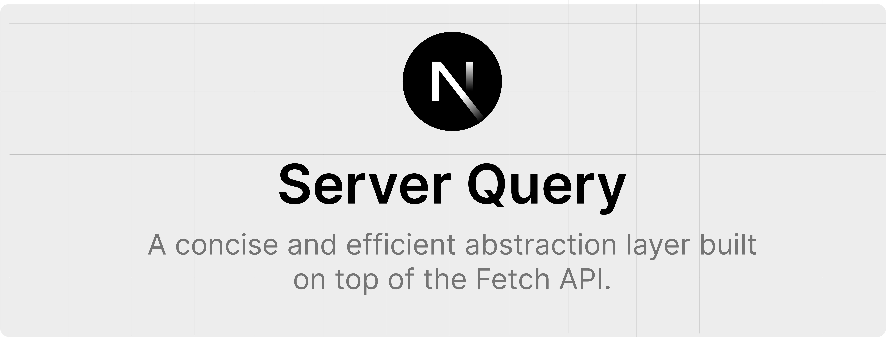

# New Updates

- We gained a 155 downloads in less than a day 📈, huge thanks to the community
- Data streaming now supported
  ```tsx
  import { streamServerQueryResponse } from "nextjs-server-query";
  ```
- Caching and `cacheInterval` not supported with `streamServerQueryResponse`
- `externalServerQuery` has been replaced with a simpler and lighter approach, to replicate the functionality, use the `external` prop in `serverQuery`

  ```tsx
  import {serverQuery} from "nextjs-server-query"

  export dafault async function App () {

   const {data, isLoading, error} = serverQuery<T>({
     ...,
      external: true
   })

   return (
     ...
   )
  }
  ```

- Nested Queries currently in development
- Invalidate function in development

# Info

Server Query is built for Next JS server components (Recommended)

- Not recommended for client side data fetching, libraries like react-query handle client-side data fetching better
- Pages where serverQuery is to be used should be exporting an async function
  ```tsx
  export default async function Page () {
     ...
  }
  ```
- Caching, Caching intervals, Error & Loading States, provided
- More updates and feaures coming soon.

# Usage

### 1. Create a next app with the App Router

```
npx create-next-app@latest
```

### 2. Import serverQuery

```tsx
import { serverQuery } from "nextjs-server-query";
```

### 3. Set up a simple API

```md
//folder structure

src -> app -> api -> posts -> route.ts
```

```tsx
//route.ts

import { NextResponse } from "next/server";

interface Post {
  userId: number;
  id: number;
  title: string;
  body: string;
}

const posts: Post[] = [
  { userId: 1, id: 1, title: "Post 1", body: "This is the first post." },
  { userId: 1, id: 2, title: "Post 2", body: "This is the second post." },
  { userId: 2, id: 3, title: "Post 3", body: "This is the third post." },
];

export async function GET() {
  return NextResponse.json(posts);
}
```

### 4. Set up .env variable

This is variable will be added before any url/route you'll enter. If you're not in development mode, change the url accordingly

```
//.env file

URL = http://localhost:3000
```

If you're looking to use external urls we've also made provisions, add the external prop and set it to true

```tsx
 const { data, isLoading, error } = await serverQuery<Post[]>({
  ...,
    external: true
  });
```

this will eliminate this stage but note that no url variable will be added before the url name

### 5. Bring It all together

This is a next js 13 project using the App Router and Tailwind CSS

```tsx
import { serverQuery } from "nextjs-server-query";

interface Post {
  userId: number;
  id: number;
  title: string;
  body: string;
}

export default async function Home() {
  const { data, isLoading, error } = await serverQuery<Post[]>({
    url: "/api/posts",
    params: {
      method: "GET",
    },
  });

  return (
    <main className="space-y-5 px-5 max-w-sm mx-auto py-5">
      {data?.map((post: Post, index: number) => {
        return (
          <div
            className="border border-blue-600 bg-blue-100 rounded-xl p-5 space-y-3 text-blue-600"
            key={index}
          >
            <h1 className="text-xl font-semibold">{post.title}</h1>
            <p className="font-medium">{post.body}</p>
            <p className="font-medium">User Id:{post.userId}</p>
          </div>
        );
      })}
      {isLoading && "Loading..."}
      {error && "An error has occured"}
    </main>
  );
}
```

# Props

| Props         | Types                       | Description                   |
| ------------- | --------------------------- | ----------------------------- |
| url           | RequestInfo or URL          | The URL of your API           |
| params        | Request Init (optional)     | Request Object                |
| cacheData     | boolean (false by default)  | Opt in to data caching        |
| cacheInterval | number (20 mins by default) | interval before revalidating  |
| external      | boolean (false by default)  | Opt in to using external urls |
